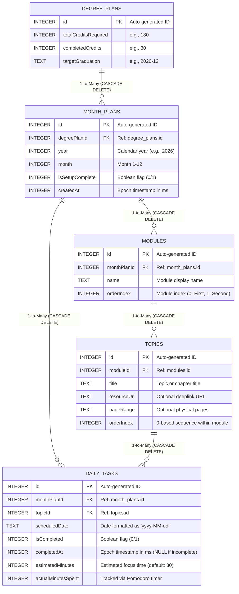

# 📚 IU Study Tracker — Comprehensive Project & Architecture Documentation

---

## 📑 Table of Contents
1. [Executive Summary & Project Mission](#1-executive-summary--project-mission)
2. [High-Level System Architecture & Tech Stack](#2-high-level-system-architecture--tech-stack)
3. [Deep-Dive Feature Specifications](#3-deep-dive-feature-specifications)
   - [3.1 Smart Monthly Setup & Module Ingestion](#31-smart-monthly-setup--module-ingestion)
   - [3.2 Cognitive Interleaving & Scheduling Engine](#32-cognitive-interleaving--scheduling-engine)
   - [3.3 Real-Time Interactive Dashboard](#33-real-time-interactive-dashboard)
   - [3.4 Calendar View & Day Inspector](#34-calendar-view--day-inspector)
   - [3.5 Progress Analytics & Study Streak Engine](#35-progress-analytics--study-streak-engine)
   - [3.6 Automated Background Notifications](#36-automated-background-notifications)
   - [3.7 Adaptive & Responsive UI System](#37-adaptive--responsive-ui-system)
   - [3.8 Macro-Level Degree Roadmap](#38-macro-level-degree-roadmap)
   - [3.9 Gamified Progression & Rank System](#39-gamified-progression--rank-system)
   - [3.10 Pomodoro Focus Timer UI](#310-pomodoro-focus-timer-ui)
   - [3.11 Resource & Material Deep-Linking](#311-resource--material-deep-linking)
   - [3.12 Dynamic Catch-Up Algorithm](#312-dynamic-catch-up-algorithm)
   - [3.13 Curriculum Management](#313-curriculum-management)
4. [Complete Database Architecture & Schema](#4-complete-database-architecture--schema)
   - [4.1 Entity Relationship Diagram (ERD)](#41-entity-relationship-diagram-erd)
   - [4.2 Table Definitions & SQLite DDL](#42-table-definitions--sqlite-ddl)
   - [4.3 Data Access Objects (DAOs) & Query Patterns](#43-data-access-objects-daos--query-patterns)
   - [4.4 Relationship Models & Joined Projections](#44-relationship-models--joined-projections)
5. [End-to-End Data Flow & Lifecycle](#5-end-to-end-data-flow--lifecycle)
6. [Project Directory & File Map](#6-project-directory--file-map)
7. [Testing, Build, and Deployment Guide](#7-testing-build-and-deployment-guide)

---

## 1. Executive Summary & Project Mission

**IU Study Tracker** is an offline-first, native Android application engineered specifically for university students managing dual-module monthly academic curriculums (such as the monthly course model employed by IU International University of Applied Sciences).

### The Problem
University students studying dual concurrent modules frequently face two key challenges:
1. **Cognitive Fatigue & Blocked Cramming**: Studying a single subject for days at a time results in diminishing retention and mental burnout.
2. **Scheduling Overhead**: Manually planning and distributing 10–25 textbook chapters or lecture topics across uneven calendar days (while factoring in rest days and mid-month start dates) is tedious and error-prone.

### The Solution
IU Study Tracker automates the academic planning lifecycle:
- Users input their two modules and corresponding topic lists at the start of each month.
- The **TopicScheduler Engine** interleaves the topics using round-robin distribution and balances them across the calendar month.
- The **Dashboard** gives students a focused daily view with one-tap completion tracking.
- The **Progress & Streak Engine** computes completion velocity, module-by-module breakdown, and historical daily streaks.
- **WorkManager** delivers automated daily reminders locally on the device without requiring cloud connectivity.

---

## 2. High-Level System Architecture & Tech Stack

The project adheres to modern Android Clean Architecture guidelines and the Unidirectional Data Flow (UDF) pattern:

```
┌────────────────────────────────────────────────────────────────────────┐
│                               UI Layer                                 │
│  Jetpack Compose + Material 3 (Screens, Navigation, Themes, StateFlow) │
└───────────────────────────────────┬────────────────────────────────────┘
                                    │ Observes UI State / Sends User Events
                                    ▼
┌────────────────────────────────────────────────────────────────────────┐
│                             ViewModel                                  │
│  SetupViewModel / DashboardViewModel / CalendarViewModel / ProgressVM  │
└───────────────────────────────────┬────────────────────────────────────┘
                                    │ Invokes Business Methods
                                    ▼
┌────────────────────────────────────────────────────────────────────────┐
│                          Repository Layer                              │
│            StudyRepository (Single Source of Truth)                    │
└───────────────┬────────────────────────────────────────┬───────────────┘
                │ Coordinates Scheduling                 │ Reactive Flow Queries
                ▼                                        ▼
┌───────────────────────────────┐        ┌───────────────────────────────┐
│     TopicScheduler Engine     │        │     Room SQLite Database      │
│  Interleave + Date Windowing  │        │  4 Entities, 4 DAOs, Cascades │
└───────────────────────────────┘        └───────────────────────────────┘
```

### Core Technologies

| Technology | Version / Specification | Role in Application |
| :--- | :--- | :--- |
| **Language** | Kotlin 2.3.0 (Target JVM 17) | Modern type-safe, coroutine-powered development |
| **UI Framework** | Jetpack Compose (BOM 2026.04.01) | Declarative reactive UI |
| **Design System** | Material Design 3 (M3) | Dark mode, color palettes, modern typography, elevation |
| **Navigation** | Navigation Compose 2.9.2 | Type-safe navigation with animated transitions and adaptive rail |
| **Architecture** | MVVM + Repository Pattern | Clean separation of UI, business logic, and database layers |
| **Database** | Android Room 2.8.4 + KSP 2.3.1 | SQLite ORM with Kotlin `Flow` and foreign key cascade deletion |
| **Asynchrony** | Kotlin Coroutines & StateFlow | Reactive asynchronous data streams and state management |
| **Background Work** | WorkManager 2.11.0 | Battery-friendly daily background study goal notifications |
| **Build System** | Gradle 9.1.1 (Kotlin DSL) | Fast, modular build configuration |

---

## 3. Deep-Dive Feature Specifications

### 3.1 Smart Monthly Setup & Module Ingestion
- **File Location**: `app/src/main/java/com/iu/studytracker/ui/screen/setup/`
- **Component Classes**: `SetupScreen.kt`, `SetupViewModel.kt`
- **Capabilities**:
  - Allows the user to configure two active modules (Module 1 and Module 2) for the target month.
  - Dynamically add, review, and delete topics per module.
  - Form validation: Validates that both module names are non-empty and each module has at least one topic before enabling schedule generation.
  - Smooth animated transitions (Slide Up on entry, Slide Down on exit).
  - Automatically clears prior month schedules upon re-setup to ensure fresh state.

### 3.2 Cognitive Interleaving & Scheduling Engine
- **File Location**: `app/src/main/java/com/iu/studytracker/scheduler/TopicScheduler.kt`
- **Unit Tests**: `app/src/test/java/com/iu/studytracker/scheduler/TopicSchedulerTest.kt`

The scheduler converts raw topic lists into an optimal study calendar through a three-stage mathematical pipeline:

#### Stage 1: Round-Robin Interleaving
Given topics $A = [A_1, A_2, A_3, \dots, A_n]$ and $B = [B_1, B_2, \dots, B_m]$, the engine produces an alternating sequence:
$$\text{Sequence} = [A_1, B_1, A_2, B_2, A_3, B_3, \dots]$$
If one module has more topics than the other, the remaining topics gracefully trail at the end. This alternating structure optimizes memory consolidation and active recall.

#### Stage 2: Date Windowing
- Evaluates the active date range $[ \text{effectiveStart}, \text{lastDayOfMonth} ]$.
- If setup occurs mid-month (e.g. August 15), the scheduler only assigns topics to the remaining days (August 15–31), automatically adjusting task density.
- If setup is done prior to the month starting, day 1 is used as the base date.

#### Stage 3: Dynamic Distribution Modes
- **Sparse Schedule ($\text{Topics} \le \text{Available Days}$)**:
  Topics are distributed evenly across the month using the index mapping:
  $$\text{dayIndex} = \left\lfloor \frac{i \times \text{totalDays}}{\text{totalTopics}} \right\rfloor$$
  Days without assigned topics naturally become scheduled rest days.
- **Dense Schedule ($\text{Topics} > \text{Available Days}$)**:
  Distributes multiple topics per day:
  $$\text{baseCount} = \lfloor \text{topics} / \text{days} \rfloor, \quad \text{remainder} = \text{topics} \pmod{\text{days}}$$
  The first `remainder` days receive $\text{baseCount} + 1$ topics, and remaining days receive $\text{baseCount}$ topics, ensuring balanced distribution.

#### Stage 4: Summary Generation (`ScheduleSummary`)
Computes detailed statistics for the generated schedule:
- Total topics, total calendar days, average topics per study day, maximum topics per day, rest days count, and start/end dates.

### 3.3 Real-Time Interactive Dashboard
- **File Location**: `app/src/main/java/com/iu/studytracker/ui/screen/dashboard/`
- **Component Classes**: `DashboardScreen.kt`, `DashboardViewModel.kt`
- **Capabilities**:
  - **Dynamic Date & Greeting**: Displays current date, day of the week, and formatted month.
  - **Today's Goal Tracker**: Visual circular/card progress showing completion ratio (e.g. `2 / 3 Completed`).
  - **Color-Coded Topic Cards**:
    - Purple theme (`#8B5CF6`) for Module 1.
    - Cyan theme (`#06B6D4`) for Module 2.
  - **Interactive Checkbox**: Immediate one-tap toggle with animated strikethrough text and SQLite status update.
  - **Empty / Rest Day State**: Shows a dedicated motivational card when no tasks are scheduled for the day.
  - **Quick Setup Floating Action Button**: Direct navigation to edit/re-setup the monthly plan.

### 3.4 Calendar View & Day Inspector
- **File Location**: `app/src/main/java/com/iu/studytracker/ui/screen/calendar/`
- **Component Classes**: `CalendarScreen.kt`, `CalendarViewModel.kt`
- **Capabilities**:
  - **Monthly Calendar Grid**: Automatically computes starting day of the week and days in month.
  - **Visual Day Badges**:
    - Highlights current date (`Today`).
    - Indicates scheduled tasks using module-themed colored dot indicators.
    - Highlights fully completed days with green completion rings.
  - **Day Inspector**: Tap any date on the calendar to inspect the specific topics scheduled for that day and view their completion status.

### 3.5 Progress Analytics & Study Streak Engine
- **File Location**: `app/src/main/java/com/iu/studytracker/ui/screen/progress/`
- **Component Classes**: `ProgressScreen.kt`, `ProgressViewModel.kt`
- **Capabilities**:
  - **Overall Completion Metric**: Animated progress bar and percentage of all monthly topics completed.
  - **Module-by-Module Breakdown**: Individual progress bars for Module 1 and Module 2, tracking isolated completion counts.
  - **Consecutive Study Streak Algorithm**:
    - Traverses historical days backwards from yesterday.
    - Counts consecutive days where 100% of scheduled tasks were completed.
    - Automatically ignores scheduled rest days so legitimate break days do not break the streak.
  - **Days Remaining**: Real-time counter of days left in the active calendar month.

### 3.6 Automated Background Notifications
- **File Location**: `app/src/main/java/com/iu/studytracker/worker/StudyReminderWorker.kt`
- **Capabilities**:
  - Uses Android **WorkManager** with `PeriodicWorkRequestBuilder` running once per 24 hours.
  - Queries local database for pending tasks scheduled for `today`.
  - Dispatches actionable notifications:
    - *Pending Tasks*: *"📚 Study Time! You have X topic(s) to study today. Let's go!"*
    - *Completed / Rest Day*: *"✅ Great job! All caught up for today. Keep the streak going!"*
  - Manages `NotificationChannel` (`study_reminder_channel`) with `POST_NOTIFICATIONS` runtime permission checks for Android 13+ (API 33+).

### 3.7 Adaptive & Responsive UI System
- **File Location**: `app/src/main/java/com/iu/studytracker/ui/navigation/NavGraph.kt`
- **Dual Form-Factor Support**:
  - **Phone / Compact Devices ($< 720\text{dp}$)**: Renders Material 3 `NavigationBar` at the bottom of the screen.
  - **Tablets / Large Screens ($\ge 720\text{dp}$)**: Renders Material 3 `NavigationRail` along the side, maximizing vertical content viewing area.

### 3.8 Macro-Level Degree Roadmap
- **File Location**: `app/src/main/java/com/iu/studytracker/ui/screen/roadmap/`
- **Capabilities**:
  - Displays high-level degree progress including `completedCredits` vs `totalCreditsRequired` (defaults to 180 ECTS).
  - Each completed module grants 5 ECTS towards the progression.
  - Visualizes past, present, and future `MonthPlan` records in a timeline view.
  - Highlights Target Graduation date based on user configuration.

### 3.9 Gamified Progression & Rank System
- **File Location**: `app/src/main/java/com/iu/studytracker/ui/screen/dashboard/DashboardViewModel.kt`
- **Capabilities**:
  - Calculates User Experience Points (XP) based on completed tasks (10 XP per task).
  - Assigns Dynamic Ranks: Bronze (Default), Silver (100+ XP), Gold (200+ XP).
  - Displays Rank Badge in Dashboard UI.

### 3.10 Pomodoro Focus Timer UI
- **File Location**: `app/src/main/java/com/iu/studytracker/ui/screen/dashboard/FocusTimer.kt`
- **Capabilities**:
  - Displays a modal overlay for a 25-minute Focus Timer.
  - Tracks `actualMinutesSpent` directly to the `daily_tasks` table.
  - Implements Play, Pause, and Stop actions to manage focus sessions.

### 3.11 Resource & Material Deep-Linking
- **File Location**: `app/src/main/java/com/iu/studytracker/ui/screen/dashboard/DashboardScreen.kt`
- **Capabilities**:
  - Stores a direct `resourceUri` (URL or Intent-based schema) for topics/tasks.
  - Renders a "Resource Link" quick-action icon if a resource is assigned.
  - Launches external apps or browsers for immediate access to study materials.

### 3.12 Dynamic Catch-Up Algorithm
- **File Location**: `app/src/main/java/com/iu/studytracker/scheduler/TopicScheduler.kt`
- **Capabilities**:
  - Features a user-triggered `rebalanceSchedule` function to recalculate task distribution.
  - Shifts incomplete/overdue tasks from previous days to future dates dynamically.
  - Preserves completed tasks and existing progress.

### 3.13 Curriculum Management
- **File Location**: `app/src/main/java/com/iu/studytracker/ui/screen/curriculum/`
- **Capabilities**:
  - Automatically partitions modules into "Active" and "Completed" categories.
  - Active modules are grouped and displayed by their target semester.
  - Upon completion (all topics checked off), modules naturally drop to the bottom of the list under a dedicated "Completed Modules" section, maintaining a clean and focused workspace.

---

## 4. Complete Database Architecture & Schema

The database is built on Android Room SQLite with **foreign key constraints**, **cascading deletes**, and **indexed lookup fields**.

### 4.1 Entity Relationship Diagram (ERD)



---

### 4.2 Table Definitions & SQLite DDL

#### Table 0: `degree_plans`
Stores global metadata for the overarching degree program.
- **Kotlin Entity**: `com.iu.studytracker.data.database.entity.DegreePlan`

```sql
CREATE TABLE IF NOT EXISTS `degree_plans` (
    `id` INTEGER PRIMARY KEY AUTOINCREMENT NOT NULL,
    `totalCreditsRequired` INTEGER NOT NULL,
    `completedCredits` INTEGER NOT NULL,
    `targetGraduation` TEXT NOT NULL
);
```

---

#### Table 1: `month_plans`
Stores the high-level plan for a calendar month.
- **Kotlin Entity**: `com.iu.studytracker.data.database.entity.MonthPlan`
- **Unique Index**: `(year, month)` prevents duplicate plans for the same calendar month.
- **Foreign Key**: `degreePlanId` references `degree_plans(id)`.

```sql
CREATE TABLE IF NOT EXISTS `month_plans` (
    `id` INTEGER PRIMARY KEY AUTOINCREMENT NOT NULL,
    `degreePlanId` INTEGER,
    `year` INTEGER NOT NULL,
    `month` INTEGER NOT NULL,
    `isSetupComplete` INTEGER NOT NULL DEFAULT 0,
    `createdAt` INTEGER NOT NULL,
    FOREIGN KEY(`degreePlanId`) REFERENCES `degree_plans`(`id`) ON DELETE SET NULL
);

CREATE UNIQUE INDEX IF NOT EXISTS `index_month_plans_year_month` 
ON `month_plans` (`year`, `month`);
```

---

#### Table 2: `modules`
Stores the two subjects/modules enrolled for the month.
- **Kotlin Entity**: `com.iu.studytracker.data.database.entity.Module`
- **Foreign Key**: `monthPlanId` references `month_plans(id)` with `ON DELETE CASCADE`.

```sql
CREATE TABLE IF NOT EXISTS `modules` (
    `id` INTEGER PRIMARY KEY AUTOINCREMENT NOT NULL,
    `monthPlanId` INTEGER NOT NULL,
    `name` TEXT NOT NULL,
    `orderIndex` INTEGER NOT NULL,
    FOREIGN KEY(`monthPlanId`) REFERENCES `month_plans`(`id`) ON DELETE CASCADE
);

CREATE INDEX IF NOT EXISTS `index_modules_monthPlanId` 
ON `modules` (`monthPlanId`);
```

---

#### Table 3: `topics`
Stores the individual chapters or study units for each module.
- **Kotlin Entity**: `com.iu.studytracker.data.database.entity.Topic`
- **Foreign Key**: `moduleId` references `modules(id)` with `ON DELETE CASCADE`.

```sql
CREATE TABLE IF NOT EXISTS `topics` (
    `id` INTEGER PRIMARY KEY AUTOINCREMENT NOT NULL,
    `moduleId` INTEGER NOT NULL,
    `title` TEXT NOT NULL,
    `resourceUri` TEXT,
    `pageRange` TEXT,
    `orderIndex` INTEGER NOT NULL,
    FOREIGN KEY(`moduleId`) REFERENCES `modules`(`id`) ON DELETE CASCADE
);

CREATE INDEX IF NOT EXISTS `index_topics_moduleId` 
ON `topics` (`moduleId`);
```

---

#### Table 4: `daily_tasks`
Stores the concrete scheduled study tasks assigned to calendar dates.
- **Kotlin Entity**: `com.iu.studytracker.data.database.entity.DailyTask`
- **Foreign Keys**:
  - `monthPlanId` references `month_plans(id)` with `ON DELETE CASCADE`
  - `topicId` references `topics(id)` with `ON DELETE CASCADE`
- **Indices**: Fast query performance on `monthPlanId`, `topicId`, and `scheduledDate`.

```sql
CREATE TABLE IF NOT EXISTS `daily_tasks` (
    `id` INTEGER PRIMARY KEY AUTOINCREMENT NOT NULL,
    `monthPlanId` INTEGER NOT NULL,
    `topicId` INTEGER NOT NULL,
    `scheduledDate` TEXT NOT NULL,
    `isCompleted` INTEGER NOT NULL DEFAULT 0,
    `completedAt` INTEGER,
    `estimatedMinutes` INTEGER NOT NULL DEFAULT 30,
    `actualMinutesSpent` INTEGER NOT NULL DEFAULT 0,
    FOREIGN KEY(`monthPlanId`) REFERENCES `month_plans`(`id`) ON DELETE CASCADE,
    FOREIGN KEY(`topicId`) REFERENCES `topics`(`id`) ON DELETE CASCADE
);

CREATE INDEX IF NOT EXISTS `index_daily_tasks_monthPlanId` 
ON `daily_tasks` (`monthPlanId`);

CREATE INDEX IF NOT EXISTS `index_daily_tasks_topicId` 
ON `daily_tasks` (`topicId`);

CREATE INDEX IF NOT EXISTS `index_daily_tasks_scheduledDate` 
ON `daily_tasks` (`scheduledDate`);
```

---

### 4.3 Data Access Objects (DAOs) & Query Patterns

#### 1. `MonthPlanDao` (`com.iu.studytracker.data.database.dao.MonthPlanDao`)
- `insert(monthPlan: MonthPlan): Long`
- `getByYearAndMonth(year: Int, month: Int): MonthPlan?`
- `observeByYearAndMonth(year: Int, month: Int): Flow<MonthPlan?>`
- `getById(id: Long): MonthPlan?`
- `markSetupComplete(id: Long)`
- `observeAll(): Flow<List<MonthPlan>>`
- `getWithModules(id: Long): MonthPlanWithModules?` (`@Transaction` query)
- `deleteById(id: Long)` (Triggers cascading deletion across all modules, topics, and tasks)

#### 2. `ModuleDao` (`com.iu.studytracker.data.database.dao.ModuleDao`)
- `insert(module: Module): Long`
- `insertAll(modules: List<Module>): List<Long>`
- `update(module: Module)`
- `getModulesForMonth(monthPlanId: Long): List<Module>`
- `observeModulesForMonth(monthPlanId: Long): Flow<List<Module>>`
- `getWithTopics(id: Long): ModuleWithTopics?`
- `getModulesWithTopicsForMonth(monthPlanId: Long): List<ModuleWithTopics>` (`@Transaction` query)

#### 3. `TopicDao` (`com.iu.studytracker.data.database.dao.TopicDao`)
- `insert(topic: Topic): Long`
- `insertAll(topics: List<Topic>): List<Long>`
- `getTopicsForModule(moduleId: Long): List<Topic>`
- `observeTopicsForModule(moduleId: Long): Flow<List<Topic>>`
- `countTopicsForMonth(monthPlanId: Long): Int`
- `getAllTopicsForMonth(monthPlanId: Long): List<Topic>`
- `deleteTopicsForModule(moduleId: Long)`

#### 4. `DailyTaskDao` (`com.iu.studytracker.data.database.dao.DailyTaskDao`)
- `insert(task: DailyTask): Long`
- `insertAll(tasks: List<DailyTask>)`
- `getTasksForDate(date: String): List<DailyTask>`
- `observeTasksForDate(date: String): Flow<List<DailyTask>>`
- `observeTasksForMonth(monthPlanId: Long): Flow<List<DailyTask>>`
- `markComplete(taskId: Long, completedAt: Long)`
- `markIncomplete(taskId: Long)`
- `getTotalTaskCount(monthPlanId: Long): Int`
- `getCompletedTaskCount(monthPlanId: Long): Int`
- `getIncompleteCountForDate(date: String): Int` (Used by WorkManager)
- `deleteTasksForMonth(monthPlanId: Long)`
- `observeTasksWithDetailsForDate(date: String): Flow<List<DailyTaskWithDetails>>` (Reactive JOIN query for Dashboard)
- `observeAllTasksWithDetailsForMonth(monthPlanId: Long): Flow<List<DailyTaskWithDetails>>` (Reactive JOIN query for Calendar & Progress)

---

### 4.4 Relationship Models & Joined Projections

#### 1. `ModuleWithTopics`
Room 1-to-many embedded relationship:
```kotlin
data class ModuleWithTopics(
    @Embedded val module: Module,
    @Relation(
        parentColumn = "id",
        entityColumn = "moduleId"
    )
    val topics: List<Topic>
)
```

#### 2. `MonthPlanWithModules`
Room 1-to-many embedded relationship:
```kotlin
data class MonthPlanWithModules(
    @Embedded val monthPlan: MonthPlan,
    @Relation(
        parentColumn = "id",
        entityColumn = "monthPlanId"
    )
    val modules: List<Module>
)
```

#### 3. `DailyTaskWithDetails`
High-performance flattened SQL projection used across the UI layer:
```kotlin
data class DailyTaskWithDetails(
    val taskId: Long,
    val scheduledDate: String,
    val isCompleted: Boolean,
    val completedAt: Long?,
    val estimatedMinutes: Int,
    val actualMinutesSpent: Int,
    val topicTitle: String,
    val resourceUri: String?,
    val pageRange: String?,
    val moduleName: String,
    val moduleOrderIndex: Int
)
```

Generated by the following optimized SQL query:
```sql
SELECT dt.id AS taskId, dt.scheduledDate, dt.isCompleted, dt.completedAt,
       dt.estimatedMinutes, dt.actualMinutesSpent,
       t.title AS topicTitle, t.resourceUri, t.pageRange,
       m.name AS moduleName, m.orderIndex AS moduleOrderIndex
FROM daily_tasks dt
INNER JOIN topics t ON dt.topicId = t.id
INNER JOIN modules m ON t.moduleId = m.id
WHERE dt.scheduledDate = :date
ORDER BY m.orderIndex ASC, t.orderIndex ASC;
```

---

## 5. End-to-End Data Flow & Lifecycle

```
1. User Launches App
   └─► MainActivity (Edge-to-Edge)
       └─► StudyTrackerNavGraph evaluates navigation stack
           └─► DashboardScreen loads DashboardViewModel
               └─► Repository fetches/creates current MonthPlan

2. Setup Execution (If Setup Incomplete)
   └─► SetupScreen displays module & topic input forms
   └─► User inputs Module 1 & Module 2 topics and taps "Generate Schedule"
   └─► SetupViewModel delegates to StudyRepository.setupMonthAndGenerateSchedule()
       ├─► 1. Clears existing MonthPlan & cascades related rows
       ├─► 2. Inserts new MonthPlan, Module 1, Module 2, and all Topic rows
       ├─► 3. Passes ModuleWithTopics to TopicScheduler.generateSchedule()
       ├─► 4. Distributes interleaved topics onto dates as DailyTask records
       ├─► 5. Batch-inserts DailyTask rows and marks isSetupComplete = true
       └─► 6. Navigates back to DashboardScreen

3. Daily Routine & Interaction
   └─► Dashboard observes repository.observeTodaysTasksWithDetails() via Kotlin Flow
   └─► User taps task checkbox ──► viewModel.toggleTask(id, completed)
   └─► DailyTaskDao updates row (isCompleted, completedAt)
   └─► Room automatically emits updated List<DailyTaskWithDetails>
   └─► UI instantly re-renders progress ring and task strikethroughs

4. Periodic Background Automation
   └─► StudyReminderWorker wakes up daily via WorkManager
   └─► Queries DailyTaskDao.getIncompleteCountForDate(todayString)
   └─► If tasks pending > 0 ──► Posts Notification: "You have X topics to study today"
   └─► Tapping notification launches MainActivity with single-top flag
```

---

## 6. Project Directory & File Map

```
StudyTracker/
├── .github/                         # GitHub repository configuration
├── app/
│   ├── build.gradle.kts             # App-level build config, SDK 35, Compose & Room dependencies
│   ├── proguard-rules.pro           # ProGuard rules for release shrinking
│   └── src/
│       ├── main/
│       │   ├── AndroidManifest.xml  # App declaration & POST_NOTIFICATIONS permissions
│       │   ├── java/com/iu/studytracker/
│       │   │   ├── MainActivity.kt        # Edge-to-edge Compose host activity
│       │   │   ├── StudyTrackerApp.kt     # Application class (DB singleton, WorkManager init)
│       │   │   │
│       │   │   ├── data/
│       │   │   │   ├── database/
│       │   │   │   │   ├── StudyTrackerDatabase.kt   # RoomDatabase instance & versioning
│       │   │   │   │   ├── dao/                      # Room Data Access Objects
│       │   │   │   │   │   ├── DailyTaskDao.kt       # Tasks queries, completion toggles, stats
│       │   │   │   │   │   ├── ModuleDao.kt          # Module inserts, updates, relations
│       │   │   │   │   │   ├── MonthPlanDao.kt       # Plan lifecycle & completion flags
│       │   │   │   │   │   └── TopicDao.kt           # Topic batching & ordering queries
│       │   │   │   │   ├── entity/                   # SQLite schema entities
│       │   │   │   │   │   ├── DailyTask.kt          # daily_tasks table definition
│       │   │   │   │   │   ├── Module.kt             # modules table definition
│       │   │   │   │   │   ├── MonthPlan.kt          # month_plans table definition
│       │   │   │   │   │   └── Topic.kt              # topics table definition
│       │   │   │   │   └── relation/                 # 1-to-many Room relationship models
│       │   │   │   │       ├── ModuleWithTopics.kt   # Module + List<Topic>
│       │   │   │   │       ├── MonthPlanFull.kt      # Assembled repository snapshot
│       │   │   │   │       └── MonthPlanWithModules.kt # MonthPlan + List<Module>
│       │   │   │   ├── model/
│       │   │   │   │   └── DailyTaskWithDetails.kt   # Joined UI projection model
│       │   │   │   └── repository/
│       │   │   │       └── StudyRepository.kt        # Repository bridging DAOs & UI
│       │   │   │
│       │   │   ├── scheduler/
│       │   │   │   └── TopicScheduler.kt             # Interleaving & distribution algorithms
│       │   │   │
│       │   │   ├── worker/
│       │   │   │   └── StudyReminderWorker.kt        # Daily background notification worker
│       │   │   │
│       │   │   └── ui/
│       │   │       ├── navigation/
│       │   │       │   ├── NavGraph.kt               # NavigationHost & adaptive NavRail/NavBar
│       │   │       │   └── Screen.kt                 # Sealed routes (Dashboard, Setup, etc.)
│       │   │       ├── screen/
│       │   │       │   ├── dashboard/                # Today's focus, progress, Focus Timer
│       │   │       │   │   ├── DashboardScreen.kt
│       │   │       │   │   ├── DashboardViewModel.kt
│       │   │       │   │   └── FocusTimer.kt
│       │   │       │   ├── setup/                    # Monthly module/topic input flow
│       │   │       │   │   ├── SetupScreen.kt
│       │   │       │   │   └── SetupViewModel.kt
│       │   │       │   ├── calendar/                 # Monthly calendar & Day Inspector
│       │   │       │   │   ├── CalendarScreen.kt
│       │   │       │   │   └── CalendarViewModel.kt
│       │   │       │   ├── progress/                 # Charts, module breakdown & streak
│       │   │       │   │   ├── ProgressScreen.kt
│       │   │       │   │   └── ProgressViewModel.kt
│       │   │       │   ├── curriculum/               # Active vs Completed modules
│       │   │       │   │   ├── CurriculumScreen.kt
│       │   │       │   │   └── CurriculumViewModel.kt
│       │   │       │   ├── roadmap/                  # Timeline & ECTS macro progress
│       │   │       │   │   ├── RoadmapScreen.kt
│       │   │       │   │   └── RoadmapViewModel.kt
│       │   │       │   └── settings/                 # App configuration & target graduation
│       │   │       │       └── SettingsScreen.kt
│       │   │       └── theme/                        # Material 3 Design System
│       │   │           ├── Color.kt                  # Purple/Cyan module palette & dark surfaces
│       │   │           ├── Theme.kt                  # MaterialTheme composable provider
│       │   │           └── Type.kt                   # Typography definitions
│       │   └── res/                                  # App icons, strings & themes
│       └── test/java/com/iu/studytracker/
│           └── scheduler/
│               └── TopicSchedulerTest.kt             # 12 comprehensive unit test scenarios
│
├── build_apk.bat                    # Windows Command Prompt 1-click APK build & export
├── build_apk.ps1                    # PowerShell 1-click APK build & export script
├── build.gradle.kts                 # Root project plugins & repos
├── settings.gradle.kts              # Gradle plugin & dependency resolution management
├── README.md                        # Project quickstart & overview
└── PROJECT_DOCUMENTATION.md         # Comprehensive system & database specification
```

---

## 7. Testing, Build, and Deployment Guide

### Running Automated Unit Tests
The project includes automated JUnit tests covering all scheduling edge cases (sparse schedules, dense schedules, mid-month start dates, leap years, and unequal topic lengths):

```bash
# Run all unit tests
./gradlew test

# Run TopicScheduler tests specifically
./gradlew testDebugUnitTest --tests "com.iu.studytracker.scheduler.TopicSchedulerTest"
```

### Building the APK
You can build the APK via command line or the provided one-click scripts:

```powershell
# Using PowerShell
.\build_apk.ps1

# Using Windows Batch
build_apk.bat

# Using Gradle directly
./gradlew assembleDebug
```
The output APK is exported to `output/StudyTracker-debug.apk` or `app/build/outputs/apk/debug/app-debug.apk`.

### Sideloading to Android Device
```bash
adb install -r output/StudyTracker-debug.apk
```
