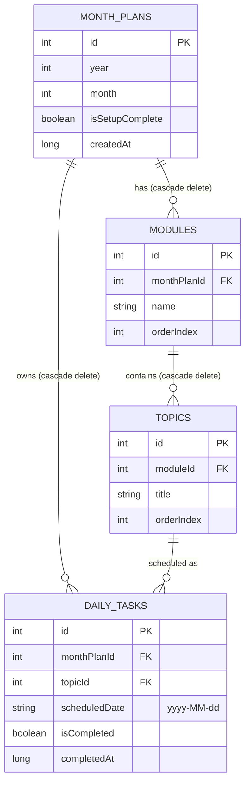

# 🐬 Dolphin Planner (formerly IU Study Tracker)

An intelligent, modern Android study planner and progress tracking application built with **Jetpack Compose**, **Material 3**, **Room SQLite**, and **Kotlin Coroutines**. 

Designed specifically for university students managing dual-module monthly curriculums (such as IU International University of Applied Sciences), Dolphin Planner automates syllabus scheduling using cognitive interleaving, tracks daily study streaks, visualizes completion metrics, and delivers automated study reminders in a calming **Ocean Theme**.

---

## 🌟 Key Features

### 📅 Smart Monthly Setup & Interleaved Scheduling
- **Dual-Module Planning**: Enter two subjects/modules and their respective topics or chapters for the month.
- **Cognitive Interleaving Algorithm**: Automatically alternates topics between the two modules round-robin style to enhance retention and avoid cognitive fatigue.
- **Adaptive Calendar Distribution**: Intelligently fits topics across remaining calendar days, accommodating rest days or multi-topic days when needed.

### 📊 Interactive Dashboard & Daily Goals
- **Today's Focus**: Instantly view all topics scheduled for the current date.
- **One-Tap Completion**: Check off finished topics with real-time progress updates.
- **Streak & Velocity Tracker**: Monitor continuous daily study streaks and overall pace.

### 🗓️ Calendar & Schedule View
- **Visual Month Overview**: Browse the entire month's timeline to inspect upcoming topics, completed milestones, and planned rest days.
- **Day Inspector**: Tap any day in the month to review or manage tasks scheduled for that date.

### 📈 Progress & Analytics
- **Module-by-Module Breakdown**: High-resolution progress bars and completion percentages for each module.
- **Overall Velocity**: Visual analytics showing total topics completed, remaining tasks, and projected completion dates.
- **Curriculum Management**: Modules are automatically separated into Active (grouped by semester) and Completed sections for easier tracking.
- **ECTS Credit Tracking**: Monitors degree progress against the 180 ECTS total (5 credits per completed module).

### ⏳ Advanced Focus Timer
- **Integrated Timer**: Start a Pomodoro-style timer directly from your daily tasks.
- **Persistent Foreground Service**: The timer reliably runs in the background and system tray, even if the app is minimized or closed.
- **Customizable Themes**: Choose your favorite visual style (Circular, Minimalist Text, or fluid Wave Fill) to stay focused.
- **Time Tracking**: Automatically logs actual minutes spent studying per task to the database.

### ⏰ Automated Background Reminders
- **WorkManager Integration**: Periodic background worker (`StudyReminderWorker`) that notifies students about pending daily study goals.
- **Android 13+ Notification Support**: Full runtime permission handling (`POST_NOTIFICATIONS`) and notification channels.
- **Themed Adaptive Icons**: Fully supports Android 13+ monochrome themed launcher icons.

### 🔒 100% Offline & Private (with Optional Sync)
- **Local SQLite Database**: By default, all study data, plans, and topics are stored locally on your device via Android Room with zero external cloud dependencies.
- **Firebase Sync**: Users can optionally connect their own Firebase project to sync data across devices. See our [Firebase Sync Guide](https://github.com/BhekumuziTshabalala/StudyTracker) (available on the official website) for more details.

---

## 🌐 Official Website & Resources

Check out the [Dolphin Planner Official Website](https://github.com/BhekumuziTshabalala/StudyTracker) (link placeholder) for:
- **Curriculum Catalog**: Browse and easily copy JSON payloads for university curriculums (e.g., BSc Computer Science) directly into your app.
- **Firebase Sync Guide**: A step-by-step tutorial on how to configure cross-device synchronization using your own personal Firebase database.

---

## 🛠️ Tech Stack & Architecture

Dolphin Planner follows modern Android development best practices and **Clean Architecture** principles with unidirectional data flow (UDF).

| Layer / Component | Technology | Description |
| :--- | :--- | :--- |
| **Language** | [Kotlin 2.3.0](https://kotlinlang.org/) | Modern, expressive, null-safe language targeting JVM 17 |
| **UI Toolkit** | [Jetpack Compose](https://developer.android.com/jetpack/compose) (BOM 2026.04.01) | Declarative UI framework |
| **Design System** | [Material 3 (M3)](https://m3.material.io/) | Dynamic theming, Dolphin Ocean color schemes, typography, and Material icons |
| **Navigation** | [Navigation Compose](https://developer.android.com/jetpack/compose/navigation) 2.9.2 | Type-safe single-activity navigation graph |
| **State & Lifecycle** | [Lifecycle ViewModel Compose](https://developer.android.com/jetpack/androidx/releases/lifecycle) 2.9.1 | UI State management via `StateFlow` and `asStateFlow()` |
| **Local Database** | [Room Database](https://developer.android.com/training/data-storage/room) 2.8.4 + [KSP](https://github.com/google/ksp) 2.3.1 | SQLite ORM with reactive Kotlin `Flow` queries & foreign key cascading |
| **Background Tasks** | [WorkManager](https://developer.android.com/topic/libraries/architecture/workmanager) 2.11.0 | Battery-friendly, guaranteed background execution for daily study reminders |
| **Build System** | [Gradle 9.1.1](https://gradle.org/) (Kotlin DSL) | Fast, reproducible multi-module build configuration |

---

## 🏗️ Project Architecture & Directory Structure

```
StudyTracker/
├── app/
│   ├── build.gradle.kts             # App-level dependencies & plugins
│   └── src/
│       ├── main/
│       │   ├── AndroidManifest.xml  # App declaration, Foreground Services & POST_NOTIFICATIONS
│       │   └── java/com/iu/studytracker/
│       │       ├── StudyTrackerApp.kt        # Application class, Room init & WorkManager setup
│       │       ├── MainActivity.kt           # Single Activity host with Edge-to-Edge Compose
│       │       ├── service/                  # Foreground Service for persistent Focus Timer
│       │       ├── data/
│       │       │   ├── database/
│       │       │   │   ├── StudyTrackerDatabase.kt # Room database instance
│       │       │   │   ├── dao/              # DAOs for MonthPlan, Module, Topic, DailyTask
│       │       │   │   ├── entity/           # SQLite entities (MonthPlan, Module, Topic, DailyTask)
│       │       │   │   └── relation/         # 1-to-Many relations (ModuleWithTopics, MonthPlanWithModules)
│       │       │   ├── model/                # UI aggregate models (DailyTaskWithDetails)
│       │       │   └── repository/           # StudyRepository handling all data operations
│       │       ├── scheduler/
│       │       │   └── TopicScheduler.kt     # Interleaving & schedule distribution algorithm
│       │       ├── worker/
│       │       │   └── StudyReminderWorker.kt# WorkManager periodic notification worker
│       │       └── ui/
│       │           ├── navigation/           # NavGraph and Screen definitions
│       │           ├── screen/
│       │           │   ├── setup/            # Initial monthly setup flow (Modules & Topics)
│       │           │   ├── dashboard/        # Today's tasks, active streak, summary cards
│       │           │   ├── calendar/         # Month calendar & day task inspector
│       │           │   ├── analytics/        # Progress charts, focus time stats & velocity
│       │           │   ├── curriculum/       # Active/Completed module organization
│       │           │   ├── focus/            # Multi-theme Pomodoro Focus Timer
│       │           │   ├── roadmap/          # Macro-level ECTS progress & timeline
│       │           │   └── settings/         # Global settings configuration
│       │           └── theme/                # Dolphin Ocean colors, typography, shapes & theme
│       └── test/java/com/iu/studytracker/
│           └── scheduler/
│               └── TopicSchedulerTest.kt     # Comprehensive unit tests for scheduling algorithm
├── build_apk.bat                    # One-click Windows batch APK build & export
├── build_apk.ps1                    # One-click PowerShell APK build & export script
├── build.gradle.kts                 # Root project plugins & repositories
├── settings.gradle.kts              # Gradle plugin & dependency resolution management
└── .gitignore                       # Clean Git configuration excluding builds, DBs & secrets
```

---

## 🗄️ Database Schema

The database relationships enforce strict data integrity with cascading deletions:



---

## ⚙️ Scheduling Algorithm Workflow

The `TopicScheduler` engine converts raw module topics into a structured daily plan:

1. **Topic Interleaving**: Takes topics from Module A (`A_1, A_2...`) and Module B (`B_1, B_2...`) and merges them in alternating order:
   `Sequence = [A_1, B_1, A_2, B_2, A_3, B_3...]`
2. **Date Windowing**: Filters active calendar days from the selected start date (or today) through the last day of the target month.
3. **Equitable Distribution**:
   - **Sparse Mode (Topics < Days)**: Evenly distributes topics with scheduled rest days to prevent cramming.
   - **Dense Mode (Topics > Days)**: Evenly clusters multiple topics per day while maintaining interleaving balance.

---

## 🚀 Getting Started

### Prerequisites
- **JDK 17** or higher
- **Android Studio** (Ladybug 2024.2.1 or newer recommended)
- **Android SDK**:
  - `compileSdk`: **35**
  - `targetSdk`: **35**
  - `minSdk`: **26** (Android 8.0 Oreo and above)

### Running from Android Studio
1. Clone or open the repository in Android Studio:
   ```bash
   git clone https://github.com/BhekumuziTshabalala/StudyTracker.git
   ```
2. Allow Gradle to sync dependencies.
3. Select an Android Virtual Device (AVD) or connect a physical Android device with USB Debugging enabled.
4. Click **Run (`Shift + F10`)** or select `app` and press ▶.

---

## 📦 Building the APK

You can build and export a standalone debug APK without opening Android Studio using the included scripts:

### Using PowerShell (Recommended on Windows)
```powershell
.\build_apk.ps1
```

### Using Batch Script
```cmd
build_apk.bat
```

### Using Gradle Wrapper directly
```bash
# Debug APK
./gradlew assembleDebug

# Release APK
./gradlew assembleRelease
```

Generated APKs are automatically placed in:
```
output/StudyTracker-debug.apk
```
Or in Gradle's default build directory:
```
app/build/outputs/apk/debug/app-debug.apk
```

### Sideloading to a Device
With USB debugging enabled:
```bash
adb install -r output/StudyTracker-debug.apk
```

---

## 🧪 Testing

Run the automated test suite to verify scheduling algorithms, database operations, and view models:

```bash
# Run unit tests
./gradlew test

# Run specific TopicScheduler tests
./gradlew testDebugUnitTest --tests "com.iu.studytracker.scheduler.TopicSchedulerTest"

# Run Android instrumented tests on connected device/emulator
./gradlew connectedAndroidTest
```

---

## 🔐 Permissions & Privacy

- `android.permission.POST_NOTIFICATIONS`: Requested at runtime on Android 13 (API 33+) to dispatch scheduled daily study reminders and host the Focus Timer foreground service.
- `android.permission.FOREGROUND_SERVICE`: Used to keep the Focus Timer running reliably in the background so you never lose your progress.
- **Privacy First**: By default, all user inputs, subject names, and completion logs remain exclusively on the user's local device in encrypted/sandboxed SQLite storage. If Firebase Sync is manually configured by the user, data is synced securely to their private Firebase instance.

---

## 📝 Changelog

### Recent Updates
- **Dolphin Planner Rebrand**: Renamed from Study Tracker to Dolphin Planner. Refactored UI strictly adhering to Material 3 padding guidelines and replaced old palettes with a calming **Dolphin Ocean** color scheme.
- **Focus Timer Overhaul**: Elevated the timer to run as a Foreground Service, ensuring it never dies when minimized. Added multi-theme support (Circular, Minimalist Text, Wave Fill) and fixed edge cases during pause/resume cycles.
- **Analytics Stability**: Refactored Room SQLite database Flow emissions using Kotlin `combine()`, resolving nested subscription bottlenecks and unlocking instant stat synchronization on the Analytics screen.
- **Themed App Icons**: Added full support for monochrome, dynamically tinted Android 13+ app icons perfectly centered in adaptive boundaries.

---

## 📄 License

This project is licensed under the MIT License — see the [LICENSE](LICENSE) file for details.
